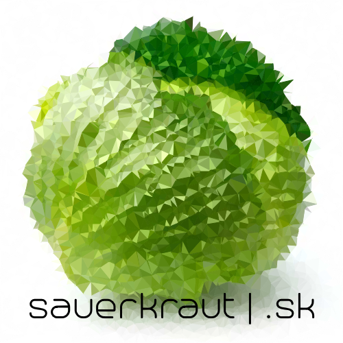

  

# Requisitos: 
	* llvm & clang -> sudo apt-get install llvm-4.0 clang-4.0
	* bison -> sudo apt-get install bison
	* flex -> sudo apt-get install flex
	* en caso de ser requerido -> sudo apt-get install lib32ncurses5-dev zlib1g-dev 
	* Puede ser necesario agregar entradas a /etc/apt/sources.list para las primeras dependencias. 
	En este caso, las fuentes a agregar dependen de la distribución y versión de Linux que se esté usando.
# Compilación del compilador:
	1. make clean && make (genera un ejecutable 'sauerkraut')
	2. (cd sklib/ && make) (compila la librería del lenguaje)
# Compilación de un programa (1):
	1. ./sauerkraut arch.sk -o arch.ll ('arch.sk' es el archivo fuente en Sauerkraut)
	2. clang arch.ll sklib/sklib.a -o arch.out
	3. ./arch.out 
# Compilación de un programa (2):
	1. ./compile.sh arch.ll (compila a 'a.out' y lo ejecuta)
# Ejecución de tests:
	* ./testAll.sh
# Códigos de ejemplo:
	* En examples/ se encontrarán numerosos programas de prueba.
		- En examples/Input/ hay ejemplos que esperan un input por parte del usuario, 
		incluyendo una implementación de fibonacci(n) programado dinámicamente.
		- En examples/error/ se encontrarán ejemplos de casos que deben fallar, 
		incluyendo un caso en el que se intenta invocar un método inexistente sobre un objeto.
		- Asimismo, en examples/ hay una implementación de quicksort en Sauerkraut.
		
